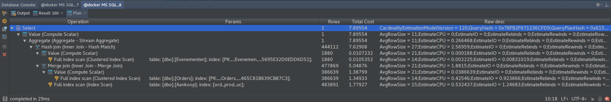
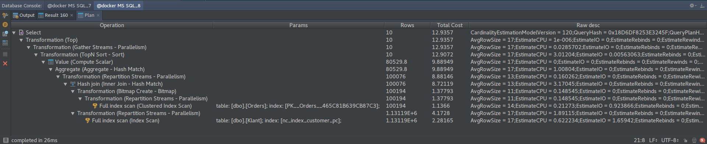
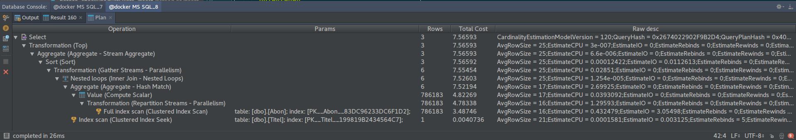

# HHS P7 Database Project
A respository for source code files, such as SQL query's.

# Testrapport queries
* Hoeveel dagen van te voren (gemiddeld) wordt een order gedaan voor een
  ticket bij een event.
* Op welke postcode (van klanten) zijn er het meeste orders gedaan in de
  laatste 5 jaar. Top 10.
* Wat zijn de titels van de 3 langst lopende abonnementen, en hoeveel
  opzegredenen heeft elke titel;
    * Van elke klant mag er maar 1 abonnement in het resultaat meegenomen worden.
    * De titels in het eindresultaat moeten uniek zijn.

## Query 1 - Event tickets
#### Requirement:
* Hoeveel dagen van te voren (gemiddeld) wordt een order gedaan voor een
  ticket bij een event.

#### Query:
```
SELECT
  AVG(DATEDIFF(DD, Evenementen.begin_dt, Orders.datum)) AS avg_dagen
FROM Evenementen
JOIN Product
  ON Evenementen.prod_nr = Product.prod_nr
JOIN Aankoop
  ON Product.prod_nr = Aankoop.prod_nr
JOIN Orders
ON Aankoop.order_nr = Orders.order_nr;
```

#### Data:
|avg_dagen|
|:---|
|382|

#### Performance:


#### Evaluatie
In het executieoverzicht van deze query wordt er gebruik gemaakt van indexes.
Dit maakt het uitvoeren van de query een stuk sneller.
Omdat er al indexes gebruikt worden, hoeven er geen extra indices toegevoegd te worden.

## Query 2 - Meeste orders per postcode
Requirement:
* Op welke postcode (van klanten) zijn er het meeste orders gedaan in de
  laatste 5 jaar. Top 10.

#### Query:
```
SELECT
  TOP(10) pc AS postcode,
  COUNT(pc) AS aantal
FROM Orders
JOIN Klant
  ON Orders.klant_id = Klant.klant_id WHERE
  Orders.datum > DATEADD(YEAR, -5, GETDATE())
GROUP BY pc
ORDER BY
  aantal DESC
```

#### Data:
|postcode|aantal|
|:---|:---|
|7811CL|37|
|2804RJ|36|
|3991AP|34|
|4715RP|31|
|2291RN|28|
|1060NX|23|
|3992SC|23|
|6043WP|23|
|6562EM|23|
|2715GL|22|

#### Performance:


#### Evaluatie
Ook in deze query wordt er geselecteerd op de indices die we aangemaakt hebben.
Het toevoegen van een extra index zou de performance niet verbeteren.

## Query 3 - Titels langst lopende abonnementen
#### Requirement:
* Wat zijn de titels van de 3 langst lopende abonnementen, en hoeveel
  opzegredenen heeft elke titel;
    * Van elke klant mag er maar 1 abonnement in het resultaat meegenomen worden.
    * De titels in het eindresultaat moeten uniek zijn.

#### Query:
```
SELECT
  TOP(3)
  titel,
  SUM(
      CASE WHEN a.opzegreden IS NOT NULL THEN
        1
      ELSE
        0
      END
  ) AS opzeg_aantal
FROM
  (
    SELECT
      abmnt,
      begin_dt,
      titel_cd,
      lezer,
      opzegreden,
      ROW_NUMBER() OVER(
        PARTITION BY
          titel_cd, lezer
        ORDER BY
          begin_dt DESC
      ) row_number
    FROM
      Abon
  ) a
JOIN Klant
  ON Klant.klant_id = a.lezer
JOIN Titel
  ON a.titel_cd = Titel.titel_cd
LEFT JOIN Opzegreden
  ON a.opzegreden = Opzegreden.opzegreden
WHERE
  row_number = 1
GROUP BY
  titel;
```

#### Data:
|titel|opzeg_aantal|
|:---|:---|
|Auto van Nu|7462|
|Eten van Nu|15056|
|Kinderen van Nu|22120|

#### Performance:


#### Evaluatie
Ok deze query maakt gebruik van selects op een index om de query een stuk te versnellen.
Het toevoegen van extra indices is natuurlijk mogelijk, maar dit zou de query niet versnellen.
